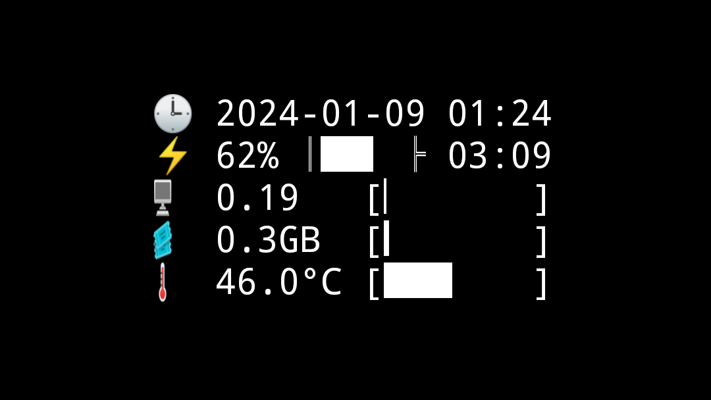
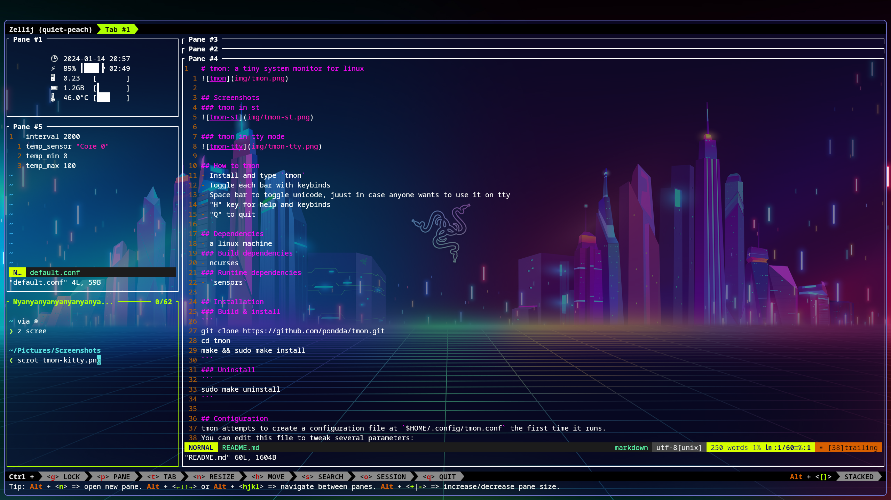
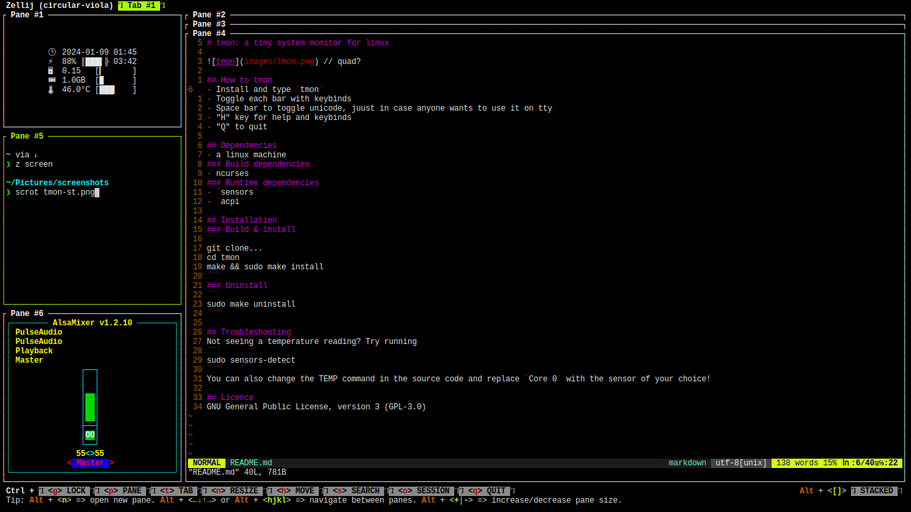
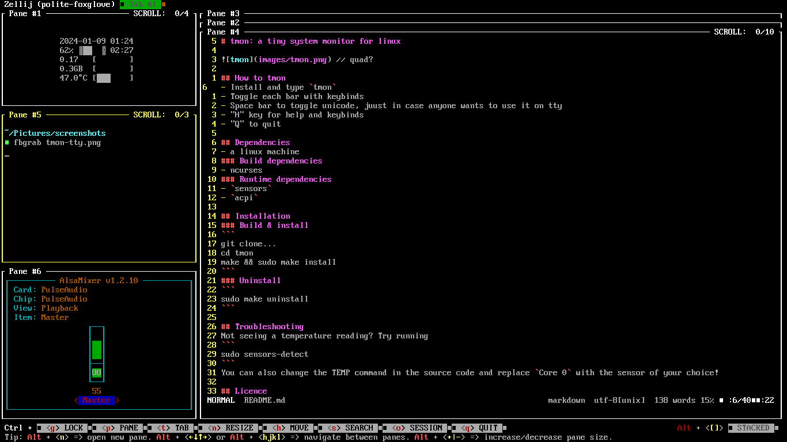

# tmon: a tiny system monitor for linux


## Screenshots
### tmon in kitty


### tmon in st


### tmon in tty mode


## How to tmon
- Install and type `tmon`
- Toggle each bar with keybinds
- Space bar to toggle unicode, juust in case anyone wants to use it on tty
- "H" key for help and keybinds
- "Q" to quit

## Dependencies
- a linux machine
### Build dependencies
- ncurses
### Runtime dependencies
- `sensors`

## Installation
### Build & install
```
git clone https://github.com/pondda/tmon.git
cd tmon
make && sudo make install
```
### Uninstall
```
sudo make uninstall
```

## Configuration
tmon attempts to create a configuration file at `$HOME/.config/tmon.conf` the first time it runs.  
You can edit this file to tweak several parameters:
- `interval`: the interval at which tmon refreshes its output, in milliseconds.
- `temp_sensor`: the target sensor for the temperature bar. Run `sensors` to see what's available.
- `temp_min`: minimum value of the temperature bar, in °C.
- `temp_max`: maximum value of the temperature bar, in °C.  

tmon needs to be restarted to reload changes to the config file.

The default settings can be restored by either:
- deleting `$HOME/.config/tmon.conf` and running tmon again  
or
- copying and pasting `default.conf` to `$HOME/.config/tmon.conf`

## Troubleshooting
Not seeing a temperature reading? Try running
```
sudo sensors-detect
```
You can also change the target sensor by changing the `temp_sensor` field in the config file.

## Licence
GNU General Public License, version 3 (GPL-3.0)
